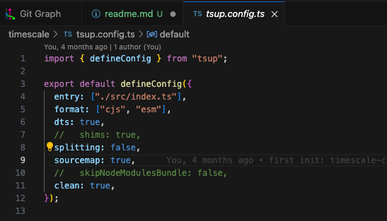
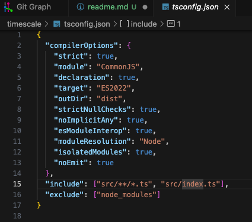
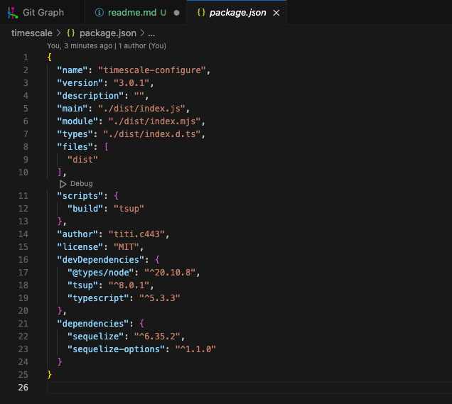
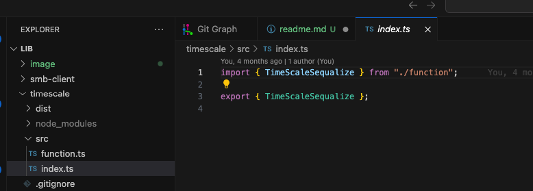
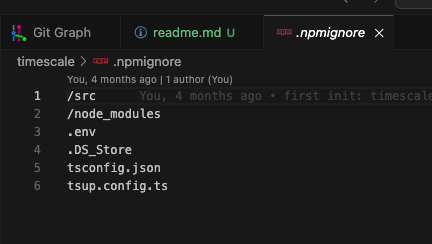
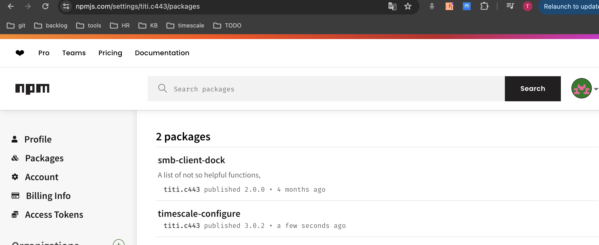

#### How to create custom package for npm

##### 1. set up on tsup.config.ts

    

##### 2. Configure tsconfig.json

##### 3. Configure package.json

install tsup (package for build lib/module)

\*\* Change version before publish : "version": "3.0.2",

##### 4. Implement module

##### 5. Configure .npmignore

##### Piblish npm to npm repo

##### 6. Check package on repo

